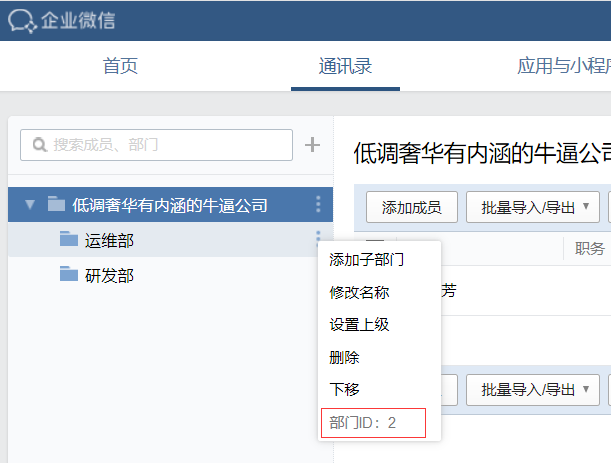

# AlertManager部署

## 参考链接

[https://prometheus.io/docs/alerting/configuration/](https://prometheus.io/docs/alerting/configuration/)

## 下载链接

[https://prometheus.io/download/](https://prometheus.io/download/)

## 安装配置alertmanager

```bash
[root@centos7 ~]# tar xvf alertmanager-0.16.0.linux-amd64.tar.gz
[root@centos7 ~]# cd alertmanager-0.16.0.linux-amd64/
[root@centos7 alertmanager-0.16.0.linux-amd64]# chown root:root alertmanager amtool
[root@centos7 alertmanager-0.16.0.linux-amd64]# cp alertmanager amtool /usr/bin
[root@centos7 alertmanager-0.16.0.linux-amd64]# cp alertmanager.yml /etc/prometheus/
[root@centos7 alertmanager-0.16.0.linux-amd64]# chown -R prometheus:prometheus /etc/prometheus
[root@centos7 alertmanager-0.16.0.linux-amd64]# mkdir /var/lib/alertmanager
[root@centos7 alertmanager-0.16.0.linux-amd64]# chown prometheus:prometheus /var/lib/alertmanager/
[root@centos7 alertmanager-0.16.0.linux-amd64]# vi /usr/lib/systemd/system/alertmanager.service
[Unit]
Description=Prometheus Alertmanager
After=network.target

[Service]
User=prometheus
Group=prometheus
Type=simple
ExecStart=/usr/bin/alertmanager \
    --config.file /etc/prometheus/alertmanager.yml \
    --storage.path /var/lib/alertmanager/
ExecReload=/usr/bin/kill -HUP $MAINPID

[Install]
WantedBy=multi-user.target
```

修改Prometheus配置，将告警信息发送到alertmanager；

```bash
[root@centos7 ~]# vi /etc/prometheus/prometheus.yml
alerting:
  alertmanagers:
  - static_configs:
    - targets:
      - localhost:9093
```

## 配置firewalld

```bash
[root@centos7 ~]# firewall-cmd --zone=public --add-port=9093/tcp --permanent
[root@centos7 ~]# firewall-cmd --zone=public --add-port=9094/tcp --permanent
[root@centos7 ~]# firewall-cmd --reload
```

## 配置微信告警

配置alertmanager使用企业微信发送告警信息。

```bash
[root@centos7 ~]# vi /etc/prometheus/alertmanager.yml
global:
  resolve_timeout: 2m

route:
  group_by: ['alertname']
  group_wait: 10s
  group_interval: 10s
  repeat_interval: 1h
  receiver: 'wechat'

receivers:
- name: 'wechat'
  wechat_configs:
  - send_resolved: true
    to_user: 'xxx|xxx'
    to_party: '1'
    agent_id: '1000002'
    corp_id: 'xxxxxxx'
    api_secret: 'xxxxxxxx'
```

* 企业微信可自行注册，注册地址[https://work.weixin.qq.com/](https://work.weixin.qq.com/);
* 注册完成后，可在“应用与小程序->自建->创建应用”，创建完成后，可获得`agent_id`和`api_secret`;
* `corp_id`可以在“我的企业”页面最下方获取到；
* `to_user`可以在“通讯录->姓名->帐号”获取到；
* `to_party`对应部门id，获取方法见下图：



## 配置邮件告警

```bash
global:
  smtp_smarthost: 'smtp.139.com:465'
  smtp_from: 'xxx'
  smtp_auth_username: 'xxx'
  smtp_auth_identity: 'xxx'
  smtp_auth_password: 'xxxx'
  smtp_require_tls: false

route:
  group_by: ['alertname']
  receiver: '139'

receivers:
  - name: '139'
    email_configs:
      - to: 'xxxx@xxx'
        send_resolved: true
```